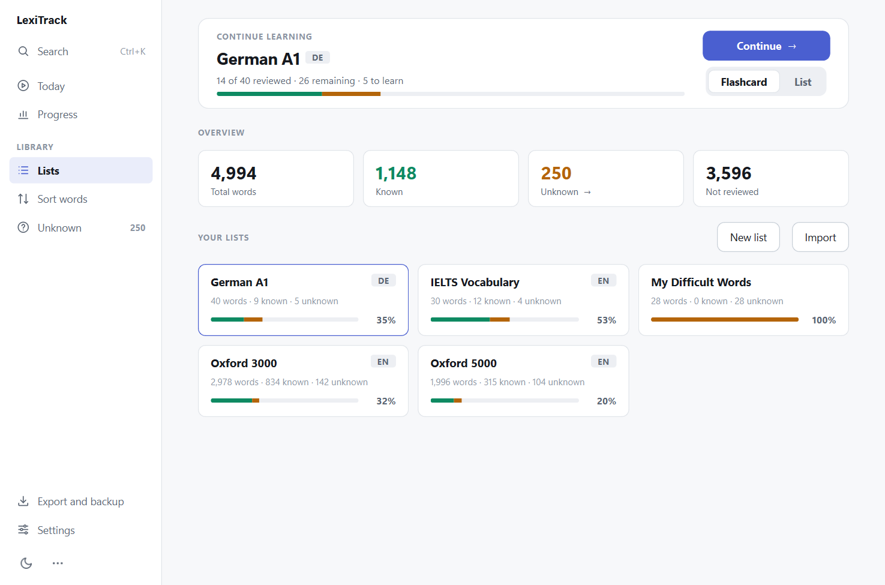
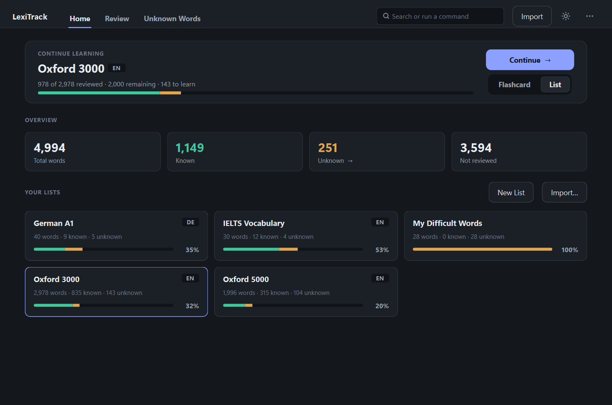
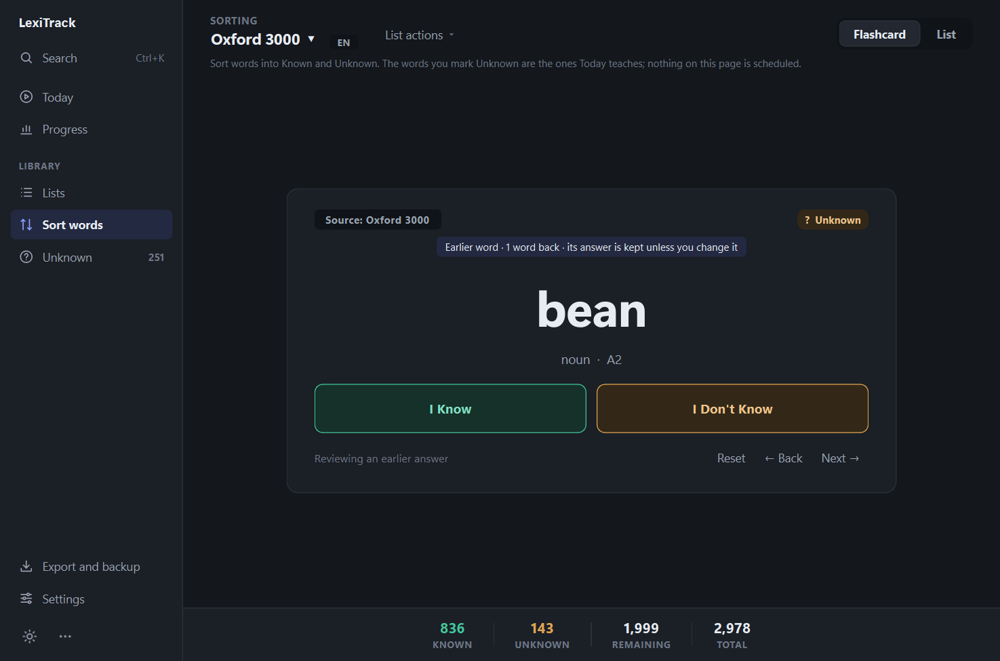
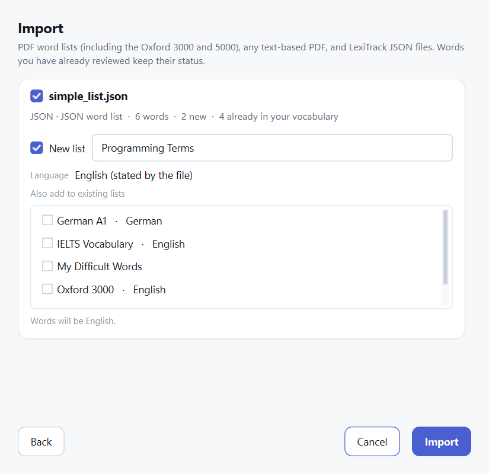
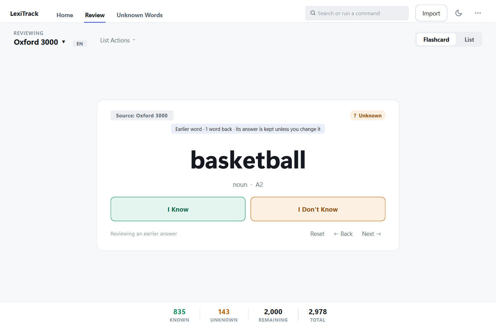
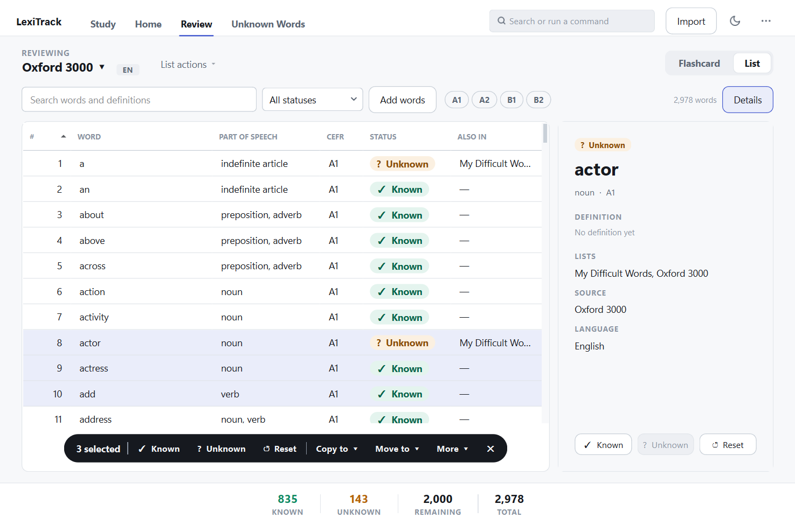
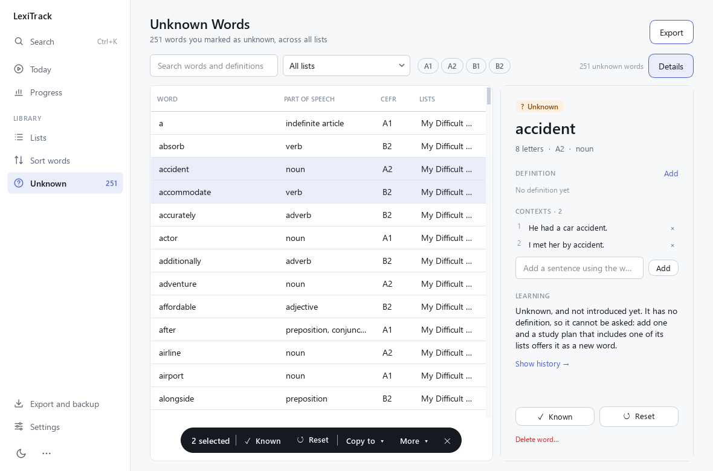
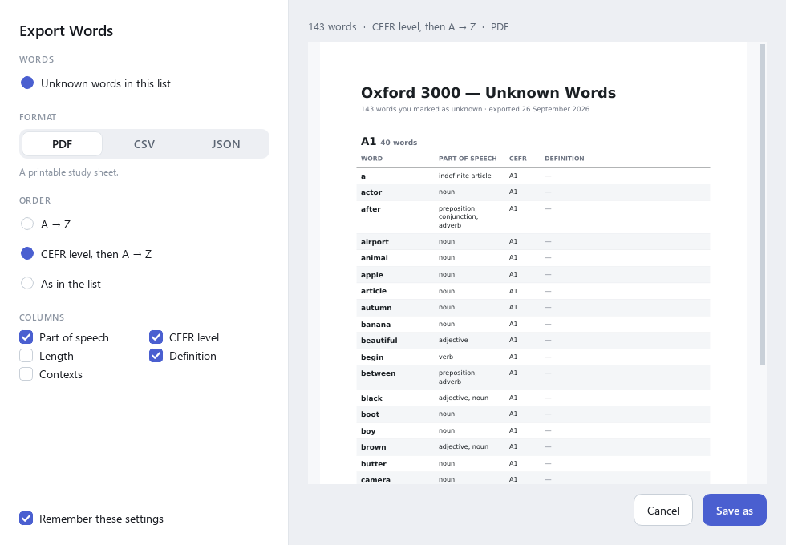
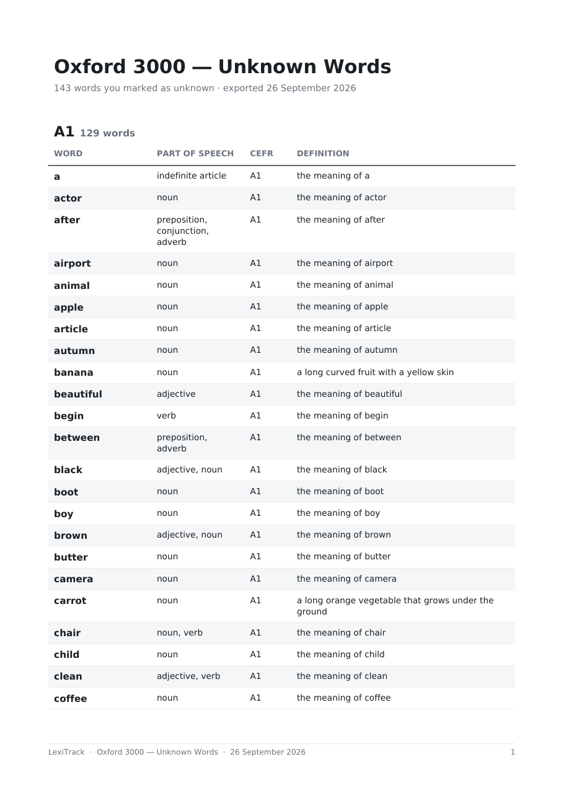
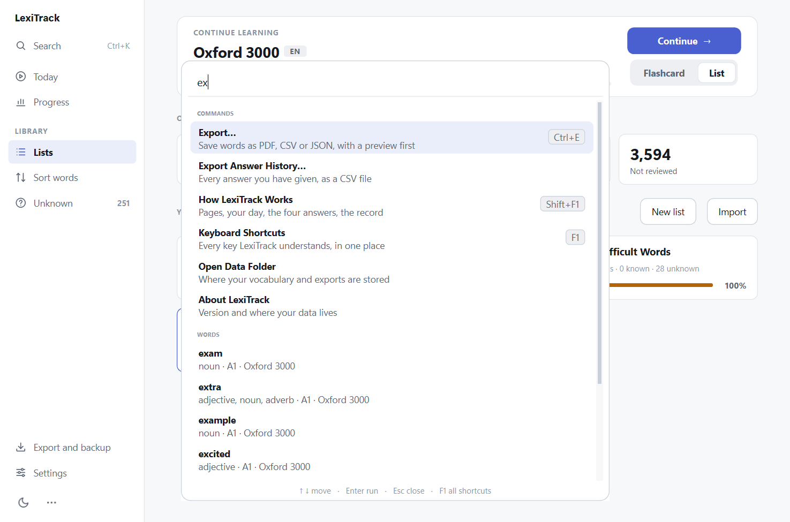

# LexiTrack

**Vocabulary Learning & Review**

LexiTrack is a desktop app for learning vocabulary from word lists. Import the
Oxford 3000, a German A1 list you wrote in JSON, or any text-based PDF; organise
words into lists; then go through them one word at a time — **I Know** or
**I Don't Know** — or work through them in a table. Everything you answer is
remembered, shared across every list a word belongs to, and exportable as a
printable PDF, a CSV or JSON.

It runs entirely on your machine. No account, no server, no network; your
vocabulary lives in a local SQLite file.



<details>
<summary><b>Dark mode</b></summary>

<br>





</details>

---

## Features

- **Lists.** Create lists, import into them, add words by hand, rename, delete.
  One word can be in many lists — "ability" in Oxford 3000, IELTS Vocabulary
  and My Difficult Words — and what you know about it is shared between them.
- **Languages.** Lists and words have a language, so English "gift" and German
  "Gift" are different words with separate progress.
- **Flashcard mode.** One large word, two equal answer buttons, keyboard-first.
- **Free movement.** ← and → step back and forward through every answer in a
  session. Moving never changes an answer; pressing K, U or R does.
- **List mode.** A searchable, sortable table of a list with CEFR level filters,
  a details panel beside it, and a floating bar for bulk Known / Unknown /
  Reset and one-step Copy to / Move to another list with Undo.
- **Definitions and notes.** Words carry a definition, an example and a short
  note (a UK/US variant, an opposite, a sense), shown on the card, in the
  details panel and in exports.
- **Ctrl+K** searches commands, lists and words from anywhere.
- **Unknown Words manager.** Every word you did not know, across all lists,
  with the lists each belongs to.
- **Import PDF and JSON**, several files at once, into new or existing lists,
  with a preview of what is new before anything is written.
- **Export with a preview** of a list, its unknown words, all unknown words or a
  selection — as PDF, CSV or JSON, alphabetically or by CEFR level. JSON exports
  import back unchanged.
- **Oxford 3000 and 5000** parsed with part of speech and CEFR level.
- **Safe upgrades.** A version 0.1 database is upgraded automatically, with a
  backup, keeping every answer.
- **Light and dark themes**, remembered between runs.

## Requirements

- **Python 3.11 or newer**
- **Windows 10/11** — developed and tested here. Nothing in the code is
  Windows-specific, but other platforms are untested.
- About 250 MB of disk space, almost all of it PySide6.

## Installation

```bash
git clone <your-repository-url> LexiTrack
cd LexiTrack
python -m venv .venv
.venv\Scripts\activate
pip install -e .
```

On macOS or Linux activate with `source .venv/bin/activate`. Dependencies are
declared in `pyproject.toml`; there is no `requirements.txt`. For development:

```bash
pip install -e ".[dev]"
```

> **Windows note.** PySide6 unpacks deeply nested files, so installing into a
> folder whose path is already very long can fail with
> `[WinError 206] The filename or extension is too long`. Clone somewhere
> shorter, such as `C:\Projects\LexiTrack`, or enable long paths in Windows.

`pip install -e .` runs LexiTrack from the clone and keeps its data in the
clone's `data/` folder, which suits development. `pip install .` installs a
regular copy, which keeps its data in your user folder. Both work the same way;
*Where your files live* below shows where each one stores its files.

## Running

```bash
lexitrack
```

or `python -m lexitrack`, or `.venv\Scripts\lexitrack-gui.exe` to start without
a console window. The database is created on first launch.

`pip` creates `lexitrack.exe` and `lexitrack-gui.exe` in the environment's
`Scripts` folder (`.venv\Scripts` above). They are generic launchers without
an icon of their own. For a proper desktop shortcut with the LexiTrack icon:

```bash
lexitrack --create-shortcut
```

This puts `LexiTrack` on the Windows desktop. It starts the app with the same
Python you ran the command with, so a virtual environment is honoured, and
without a console window. Run it again after moving the clone.

Other options: `--minimized` starts in the tray without a window (this is what
*Start with Windows* uses), and `--headless` runs only the Telegram bot,
without any window, until Ctrl+C.

### Where your files live

| What | From a clone (`pip install -e .`) | Installed copy (`pip install .`) |
| --- | --- | --- |
| Database, backups, exports | `<clone>\data` | `%LOCALAPPDATA%\LexiTrack` |
| Telegram token (`.env`) | `<clone>\.env` or the data folder | `%LOCALAPPDATA%\LexiTrack\.env` |
| Debug logs (only when turned on) | `<clone>\logs` | `%LOCALAPPDATA%\LexiTrack\logs` |

`%LOCALAPPDATA%` is `C:\Users\<you>\AppData\Local`, the standard place on
Windows for an application's own data. Setting `LEXITRACK_DATA_DIR` overrides
the data folder for either kind of install.

Daily backups go to `backups` inside the data folder; the newest ten are kept.
Logs are written only when *Settings → Advanced → Debug logging* is on, one
file a day, kept for a week.

**Upgrading from 0.1:** just start the new version. Your database is upgraded
in place, each document you imported becomes a list, and a copy of the old
file is kept in the data folder (`vocabulary.v1-backup-<date>.db`).

## Usage

### Importing

**Import** in the app bar (`Ctrl+O`). Choose one or more
PDF or JSON files. Each file gets a preview: the detected format, how many
words it has, how many are new, any problems, and where the words should go —
a new list named from the file, any existing lists, or both.



If a file states its language and you choose a list in another language, the
preview explains the clash instead of importing. Nothing is written until you
press Import.

### Reviewing with flashcards

**Continue** on Home, or the **Review** tab. The list you are reviewing is the
name at the top — click it to switch lists. Where the word came from is the
small "Source" line on the card.



Press **←** (or Backspace) to step back through your answers and **→** to
come forward again. The card shows the
earlier word with its current status and says so; nothing changes unless you
answer again or press R.

### Reviewing as a list

Switch to **List** (`Ctrl+2`). Search, filter by status or CEFR level (click
A1, B2… to combine levels), sort by any column, select rows
(`Shift`/`Ctrl`+click, `Ctrl+A`) and mark them together. The **details panel**
on the right follows the current row: definition, note, example, lists and
source. Looking at a word never marks it — only an action does.



Selecting words brings up a bar floating over the bottom of the table, so
the rows never move. **Copy to** and **Move to** send the selection to another
list in one step —
the menu lists every list that can take the words, plus New List. Copying
keeps the words here too; moving takes them out of this list, never out of
your vocabulary. The result appears briefly at the bottom with **Undo**. The
**Also In** column shows which other lists each word is in. Right-click a row
for every action, or press **C** / **M** to pick a list from the keyboard.
Export and Remove are under **More** on the bar.
**Add Words…** types words in by hand; **List Actions** in the header edits,
exports or deletes the list.

### Unknown Words

Every word you answered "I Don't Know", across all lists. Mark words Known or
reset them to Not Reviewed (they leave this page, and reset words come round
again in flashcards), collect them into a list such as My Difficult Words, or
export them.



### Exporting

**Export…** (`Ctrl+E`, or the **⋯** menu) offers what fits where you are: the
current list, its unknown words, your selection, or all unknown words. The
window shows the file before you save it — the real first page of the PDF, or
the first lines of the CSV or JSON — and follows any change you make: format,
and order (A → Z, CEFR level, or as in the list). A PDF in CEFR order starts
each level with a heading, and shows each word's note under its definition.
Press **Enter** to keep the defaults and choose where to save.



<p align="center">
  
</p>

### Search and commands

**Ctrl+K**, or the search box in the app bar, finds a command (with what it
does and its shortcut), a list, or a word — choosing a word opens it in List
mode with its details. Everything else the app can do is in the **⋯** menu.



### Keyboard shortcuts

**Keyboard Shortcuts** (`F1`, also in `Ctrl+K` and the **⋯** menu) lists every
key in one place, with a filter. Shortcuts are not printed around the app.

| Where | Key | Action |
| --- | --- | --- |
| Flashcards | `K` | I Know |
| | `U` | I Don't Know |
| | `←` or `Backspace` | Previous word (status unchanged) |
| | `→` | Next word, after going back (status unchanged) |
| | `Enter` / `Space` | Repeat your last answer; on an earlier word, move forward without changing it |
| | `R` | Reset the word on screen to Not Reviewed |
| Tables | `K` / `U` / `R` | Mark the selection Known / Unknown / Not Reviewed |
| | `Ctrl+A`, `Shift`+arrows | Select |
| | `Enter` | Open the details panel |
| | `C` / `M` | Copy / move the selection to another list |
| | Right-click, `Menu` key | Every action for the selection |
| | `Delete` | Remove the selection from this list (asks first) |
| | `Ctrl+Z` | Undo a copy or move while its message shows |
| | `Ctrl+F` | Search |
| Home | Arrow keys, `Enter` | Move between lists, open one |
| Everywhere | `Ctrl+K` | Search commands, lists and words |
| | `F1` | Keyboard Shortcuts |
| | `Ctrl+Tab` / `Ctrl+Shift+Tab` | Next / previous page |
| | `Alt+H` / `Alt+R` / `Alt+U` | Home / Review / Unknown Words |
| | `Ctrl+L` | Switch list |
| | `Ctrl+1` / `Ctrl+2` | Flashcard / List mode |
| | `Ctrl+O` · `Ctrl+N` · `Ctrl+E` | Import · New list · Export |
| | `Ctrl+T` | Light / dark |

## Supported formats

| Format | Parser | What it extracts |
| --- | --- | --- |
| Oxford 3000 / 5000 "by CEFR level" PDF | `OxfordParser` | Word, part of speech, CEFR level; English |
| LexiTrack JSON | `JsonParser` | Word plus any of part of speech, CEFR, definition, example, note, language; list name, language, description, source |
| Any other text-based PDF | `GenericTextParser` | Every distinct word, nothing else |

The JSON format is documented in
[docs/formats/json-import-export.md](docs/formats/json-import-export.md), and
[`examples/`](examples) has files you can import straight away. Only `words` is
required; a typical file looks like:

```json
{ "name": "German A1", "language": "de", "words": ["Haus", "gehen", "kommen"] }
```

Importing a JSON file into a list whose words you already have fills in the
details they lack — a file of definitions for an Oxford list adds the
definitions and changes nothing you have answered.

Limitations: the Oxford PDFs contain no definitions or examples; the generic
parser cannot tell headwords from inflected forms; scanned PDFs are detected
and reported, not read (no OCR).

## Architecture

```text
   PDF      JSON      typed in
     └────────┼────────────┘
              ▼
     parsers ─► WordEntry
              ▼
     VocabularyService          the only thing the UI talks to
              ▼
     repositories               the only code that issues SQL
              ▼
            SQLite
   ┌──────────┬──────────┬───────────────┐
 words      sources     lists          status
 (language, where it    what you       what you
  word)     came from   study          know
```

Four ideas are kept strictly apart: a **word**, the **source** it came from,
the **lists** it belongs to, and your **learning status**. Navigation in a
flashcard session is a fifth, and it is never stored as status. The UI talks
only to `VocabularyService`; only repositories issue SQL.

See [docs/ARCHITECTURE.md](docs/ARCHITECTURE.md) for the full picture and
[docs/DECISIONS.md](docs/DECISIONS.md) for why.

## Project structure

```text
lexitrack/
├── core/            paths, logging, errors
├── models/          WordEntry, VocabularyList, ReviewStatus, languages
├── parsers/         PDF and JSON documents, Oxford / JSON / generic parsers
├── normalization/   word identity and deduplication
├── database/        schema.sql and migrations
├── repositories/    words, sources, lists, review state — all the SQL
├── services/        import workflow, review sessions, exports
├── exporters/       PDF, CSV, JSON
└── ui/              pages, dialogs, components, theme

examples/            JSON word lists to try
tools/               screenshot and design-mockup generators
docs/                architecture, decisions, status, log, TODO, formats, design
tests/               343 tests
data/                your database and exports (created at runtime, not committed)
pdfs/                put your PDFs here (not committed)
```

## Testing

```bash
pytest
ruff check lexitrack tests tools
```

343 tests. Tests that need the real Oxford PDFs skip when `pdfs/` does not
contain them; the rest of the suite still runs.

## Adding a parser

```python
class CambridgeParser(DocumentParser):
    key = "cambridge"
    name = "Cambridge word list"
    description = "Cambridge vocabulary PDFs."
    priority = 90              # asked before generic (-100), after Oxford (100)
    language = "en"            # if every document of this kind is English

    def can_parse(self, document: Document) -> bool:
        return "Cambridge" in document.text(max_pages=1)

    def parse(self, document, progress=None) -> list[WordEntry]:
        ...
```

Register it in `default_parsers()` in `lexitrack/parsers/registry.py`. It
appears in the import dialog, and nothing downstream of `WordEntry` changes.
For a non-PDF, non-JSON format, add a document class and set `document_types`.

## Documentation

| Document | What it covers |
| --- | --- |
| [docs/PROJECT_STATUS.md](docs/PROJECT_STATUS.md) | Where the project stands, what was verified, what is next |
| [docs/ARCHITECTURE.md](docs/ARCHITECTURE.md) | The architecture as built |
| [docs/DECISIONS.md](docs/DECISIONS.md) | Why each significant choice was made |
| [docs/DEVELOPMENT_LOG.md](docs/DEVELOPMENT_LOG.md) | Chronological technical log |
| [docs/LEARNING_ENGINE.md](docs/LEARNING_ENGINE.md) | Design for 0.3: study plans, FSRS scheduling, daily queue, Telegram (not implemented yet) |
| [docs/TODO.md](docs/TODO.md) | Next, later, ideas |
| [docs/formats/json-import-export.md](docs/formats/json-import-export.md) | The JSON format |
| [docs/design/](docs/design) | The three design directions explored for 0.2 |

## Known limitations

- **Word details cannot be edited after they are added** — status can.
- **Backspace history lasts one session.** Reopening starts at the next
  unreviewed word, as expected, but earlier answers are reached through the
  table rather than Backspace.
- **What you know is shared across lists.** A word cannot be known in one list
  and unknown in another.
- **Deleting a list deletes words that are in no other list**, with their
  status. The confirmation says how many.
- **No spaced repetition, no OCR, no lemmatization.** `run` and `running` are
  separate words.
- **No language-specific normalization yet.** German `Straße` and `Strasse`
  count as the same word.
- **Untested outside Windows.**

## License

MIT. The Oxford 3000 and Oxford 5000 word lists are © Oxford University Press
and are not distributed with this project.
