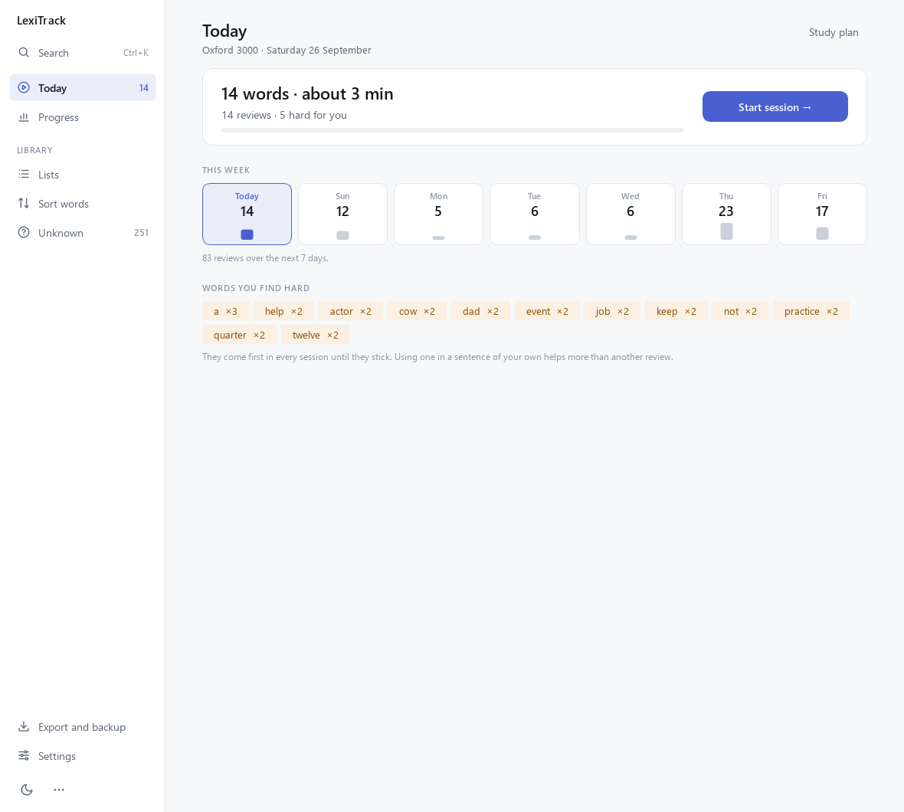
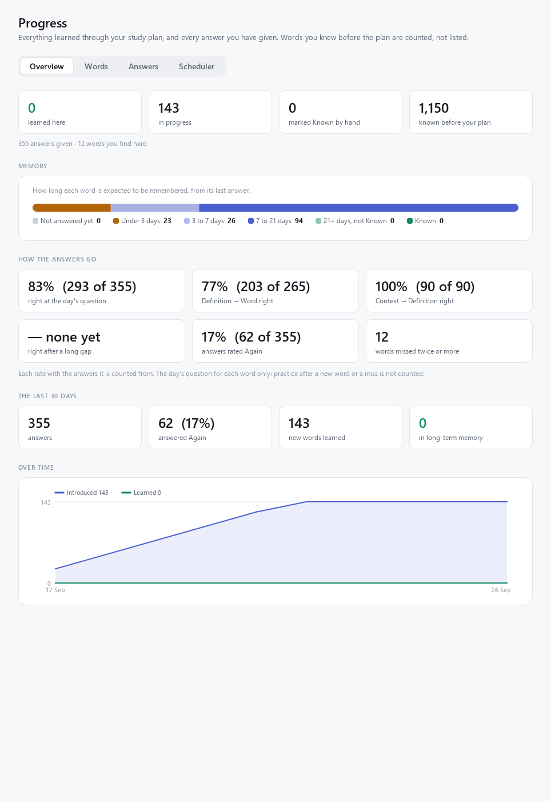
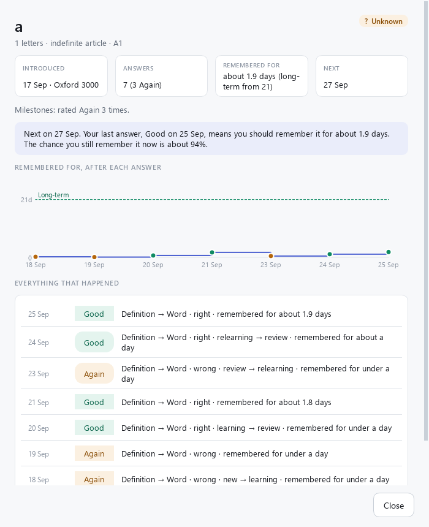
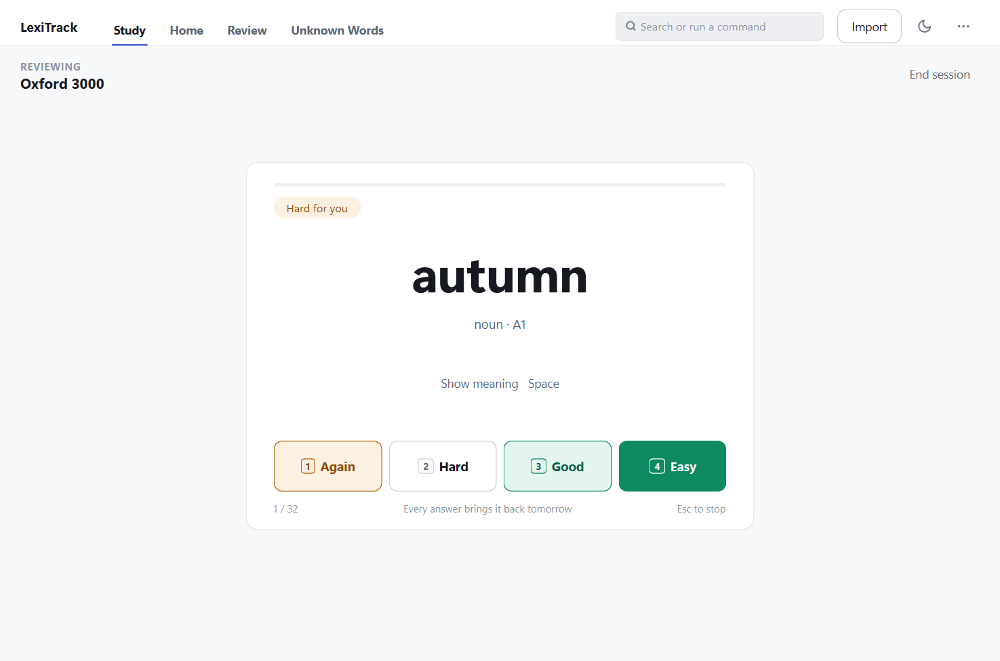
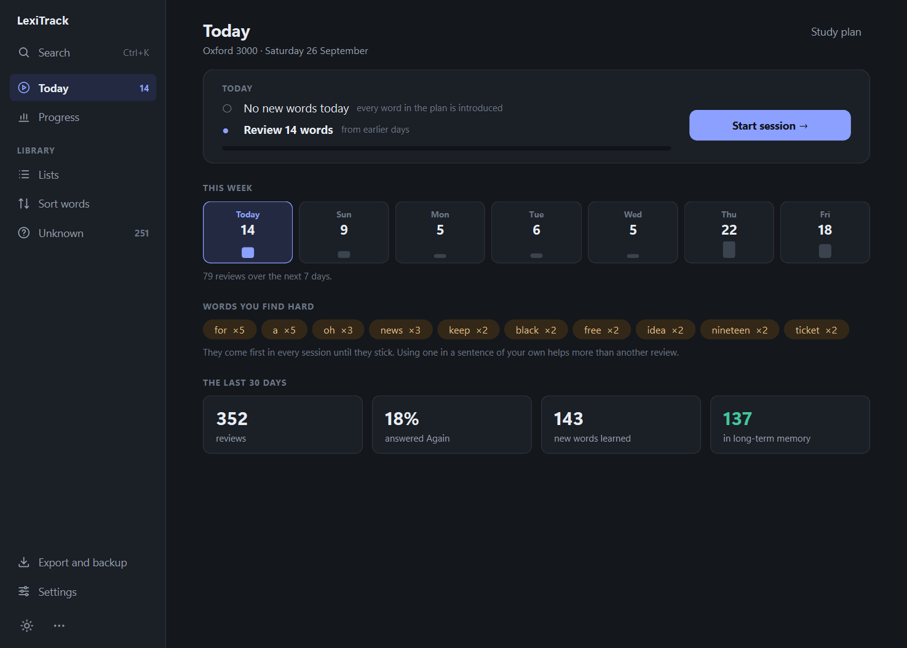
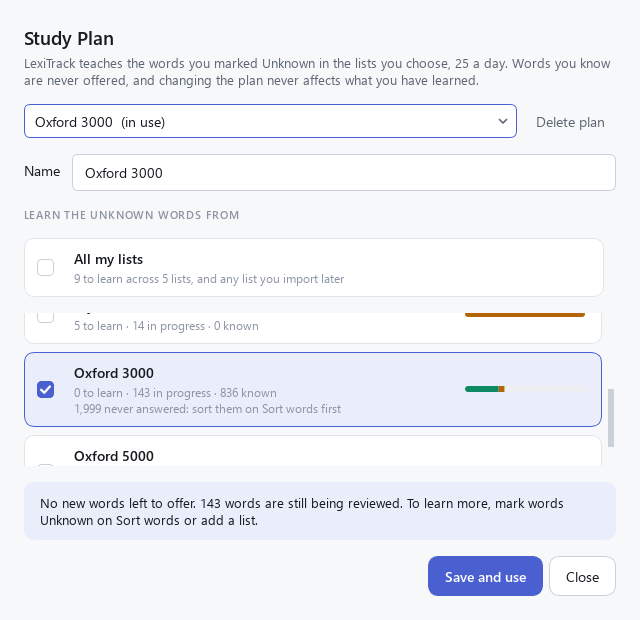
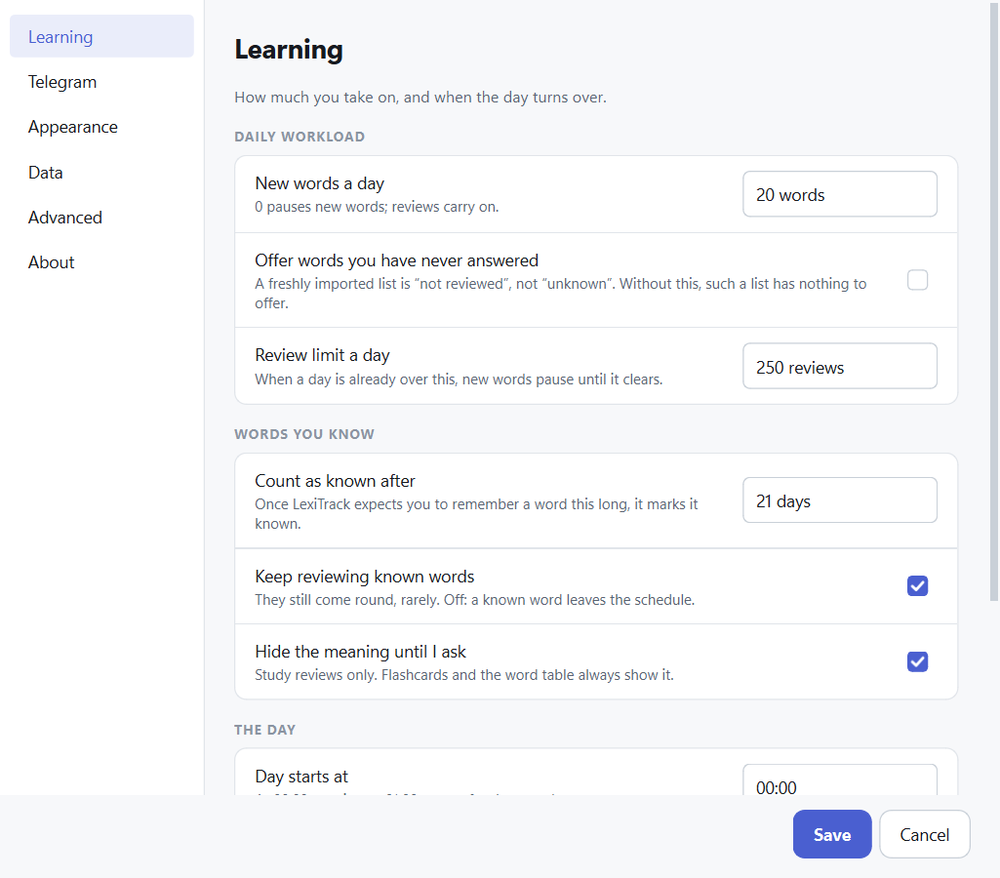

# LexiTrack

**Vocabulary Learning & Review**

LexiTrack is a desktop app for learning vocabulary from word lists. Import the
Oxford 3000, a German A1 list you wrote in JSON, or any text-based PDF, and
organise the words into lists. Then choose a **study plan**: LexiTrack offers you
a set number of new words each day and asks about each one again on the day
you are most likely to forget it, using the FSRS spaced-repetition scheduler.
You can do the day's work at the desk or on your phone through a Telegram bot.

Before that, you sort: go through any list one word at a time — **I Know** or
**I Don't Know** — or work through it in a table. The words you mark Unknown
are the ones your study plan teaches; the ones you know are never offered.

Nothing is hidden. Every answer, every change of status and every word's path
from new to Known is on the **Progress** tab, and a calibration chart shows
how well the scheduler's forecasts fit your memory — the basis for fitting it
to you once there are enough answers.

It runs on your machine. No account and no server; your vocabulary lives in a
local SQLite file. The only network use is the optional Telegram bot.



<details>
<summary><b>More screens</b></summary>

<br>











</details>

---

## Features

### Learning

- **Study plans teach what you don't know.** A plan takes the Unknown words of
  the lists you choose — or of **All my lists**, including lists added later.
  A word in two lists is learned once; words you know are never offered.
- **New words every day.** 25 by default, lowest CEFR level first. You study
  them however you like and confirm; LexiTrack never invents an answer for you.
- **Spaced repetition with FSRS.** Each review is answered Again, Hard, Good or
  Easy, and the word comes back when you are about to forget it. Every button
  shows when that would be. A word is never asked twice on the same day.
- **A day with a shape.** The Today page shows today's two steps, the week
  ahead as day tiles, the words you keep missing, and the last 30 days.
- **A workload brake.** When a day's reviews go over your limit (250 by
  default), new words pause until you catch up, and the page says why.
- **Mastery.** Once a word is expected to stick for 21 days it is marked
  Known by itself.
- **Missed days are harmless.** Nothing is owed for a day you skipped. Overdue
  reviews come first, and you still get today's new words.
- **Undo.** `Ctrl+Z`, or the button under the card, takes back your last
  answer; on Telegram every card after the first has an Undo button. The
  answer stays in the record, marked, and out of every count.

### Progress and transparency

- **Progress tab.** Words learned here, in progress, marked Known by hand and
  known before your plan, kept apart; where the words stand; words introduced
  and learned over time.
- **Every answer and every change of status**, with its cause, in two complete
  tables. Nothing the app records is out of your sight.
- **A word's history.** When it was introduced and in which plan, every
  answer, how long you were expected to remember it after each one, when and
  why it became Known, and why it is due when it is.
- **Does the schedule fit you?** The scheduler's forecasts against what you
  then remembered, with an honest verdict when there are too few answers.
- **Fitted to you** (optional). Once there are enough answers, the scheduler's
  parameters can be fitted to your own memory, compared with the defaults on
  your history first, used only if you choose, and reverted in one click.

### Telegram

- **The day's words at 06:00**, each with a short meaning, and one button to
  confirm you have studied them.
- **Reviews on your phone.** One card at a time, each replacing the last, with
  the meaning hidden until you tap it.
- **An evening reminder**, only if something is still waiting.
- **A weekly summary** on Sunday evening: the week's answers, words learned
  and the words giving you trouble.
- **Private.** The bot answers only your chat. Its token lives in a `.env`
  file, never in the database or the backups, and never in the log.

### Lists and words

- **Lists.** Create lists, import into them, add words by hand, rename, delete.
  One word can be in many lists, and what you know about it is shared between
  them.
- **Languages.** Lists and words have a language, so English "gift" and German
  "Gift" are different words with separate progress.
- **Flashcard mode.** One large word, two equal answer buttons, keyboard-first.
  ← and → step back and forward through your answers without changing them.
- **List mode.** A searchable, sortable table with CEFR level filters, a
  details panel, and a floating bar for bulk Known / Unknown / Reset and
  Copy to / Move to another list with Undo.
- **Definitions and notes** on the card, in the details panel and in exports.
- **Unknown Words manager.** Every word you did not know, across all lists.
- **Import PDF and JSON**, several files at once, with a preview first.
- **Export with a preview**: PDF, CSV or JSON, alphabetically or by CEFR level.
- **Ctrl+K** searches commands, lists and words from anywhere.

### Around the app

- **Runs in the background.** With the bot on, closing the window keeps
  LexiTrack in the system tray. The tray icon holds today's numbers, the bot
  switch, *Start with Windows* and *Quit*.
- **Settings** for the daily workload, the day boundary, Telegram, theme and
  data, with the scheduler controls and a one-year workload simulator behind
  Developer mode.
- **Daily backups** of the database; the newest ten are kept.
- **Safe upgrades.** Older databases are upgraded automatically, with a backup.
- **A first-run setup** that asks the three questions a plan needs, and
  **How LexiTrack Works** (`Shift+F1`) for everything else.
- **Light and dark themes.**

## Requirements

- **Python 3.11 or newer**
- **Windows 10/11** — developed and tested here. Most of the app works
  elsewhere, but the tray, Start with Windows and the desktop shortcut are
  Windows features, and other platforms are untested.
- About 250 MB of disk space, almost all of it PySide6.
- An internet connection only if you use the Telegram bot.

## Installation

```bash
git clone <your-repository-url> LexiTrack
cd LexiTrack
python -m venv .venv
.venv\Scripts\activate
pip install -e .
```

On macOS or Linux activate with `source .venv/bin/activate`. Dependencies are
declared in `pyproject.toml`; there is no `requirements.txt`. For development:

```bash
pip install -e ".[dev]"
```

Fitting the scheduler to your own answers (*Settings → Advanced → Fitted to
you*) needs PyTorch, a large download, so it is optional:

```bash
pip install -e ".[optimizer]"
```

> **Windows note.** PySide6 unpacks deeply nested files, so installing into a
> folder whose path is already very long can fail with
> `[WinError 206] The filename or extension is too long`. Clone somewhere
> shorter, such as `C:\Projects\LexiTrack`, or enable long paths in Windows.

`pip install -e .` runs LexiTrack from the clone and keeps its data in the
clone's `data/` folder, which suits development. `pip install .` installs a
regular copy, which keeps its data in your user folder. Both work the same way;
*Where your files live* below shows where each one stores its files.

## Running

```bash
lexitrack
```

or `python -m lexitrack`, or `.venv\Scripts\lexitrack-gui.exe` to start without
a console window. The database is created on first launch.

`pip` creates `lexitrack.exe` and `lexitrack-gui.exe` in the environment's
`Scripts` folder (`.venv\Scripts` above). They are generic launchers without
an icon of their own. For a proper desktop shortcut with the LexiTrack icon:

```bash
lexitrack --create-shortcut
```

This puts `LexiTrack` on the Windows desktop. It starts the app with the same
Python you ran the command with, so a virtual environment is honoured, and
without a console window. Run it again after moving the clone.

Other options: `--minimized` starts in the tray without a window (this is what
*Start with Windows* uses), and `--headless` runs only the Telegram bot,
without any window, until Ctrl+C.

Only one LexiTrack runs at a time. Starting it again brings the running one to
the front.

### Where your files live

| What | From a clone (`pip install -e .`) | Installed copy (`pip install .`) |
| --- | --- | --- |
| Database, backups, exports | `<clone>\data` | `%LOCALAPPDATA%\LexiTrack` |
| Telegram token (`.env`) | `<clone>\.env` or the data folder | `%LOCALAPPDATA%\LexiTrack\.env` |
| Debug logs (only when turned on) | `<clone>\logs` | `%LOCALAPPDATA%\LexiTrack\logs` |

`%LOCALAPPDATA%` is `C:\Users\<you>\AppData\Local`, the standard place on
Windows for an application's own data. Setting `LEXITRACK_DATA_DIR` overrides
the data folder for either kind of install.

Daily backups go to `backups` inside the data folder; the newest ten are kept.
Logs are written only when *Settings → Advanced → Debug logging* is on, one
file a day, kept for a week.

### Upgrading

Start the new version and your database is upgraded in place. A copy of the
old file is kept in the data folder first (`vocabulary.v1-backup-<date>.db`,
`vocabulary.v2-backup-<date>.db`); you can delete it once you are happy.

- **From 0.1:** each document you imported becomes a list.
- **From 0.2:** the learning engine's tables are added and a study plan is
  created from your largest list. Nothing is scheduled until you confirm your
  first new words, and every status you set is kept.

## Usage

### Your first start

With no study plan yet, the Today page asks three questions: what to learn —
**all your Unknown words** by default, with how many that is, or only some
lists — how many new words a day, with how long that will take, and whether
you want the day's words on your phone. **Start learning** creates the plan.
If nothing is Unknown yet, it says so: sort a list on **Sort words** first.

**How LexiTrack Works** (`Shift+F1`, the **⋯** menu, or `Ctrl+K`) explains
the pages, your day, the four answers and what is recorded.

### Finding your way

The sidebar on the left reaches every page:

- **Today** — the day's new words and reviews. The number beside it is what
  is waiting.
- **Progress** — what has been learned here, and every answer.
- Under **Library**: **Lists** (your lists), **Sort words** (going through a
  list to mark what you already know) and **Unknown** (every word you did not
  know, with their count).
- At the foot: **Export and backup** (words, your answer history, a backup
  copy now, the backups folder), **Settings**, the light/dark switch and the
  **⋯** menu with everything else.

On a narrow window the sidebar folds to its icons; hover over one for its
name. On a wide one the pages keep to a readable width instead of stretching.

### Studying

**Today** is the first page. One card says what the day holds — "40 words ·
about 15 min", with how many are reviews, how many new, and how many you
find hard — and has one button, **Start session**. The session does the
reviews first, then the new words:

1. **Review.** Words due today come one at a time, and you **type** them: from
   their meaning (in your own language if you chose one in *Settings →
   Learning* and the word has content in it, otherwise its definition, with
   the word itself hidden), and once you can do that, from a
   sentence or a phrase with a gap. **Enter** checks it; small slips are
   accepted. **Ctrl+H** shows the first letter; **Enter** with nothing typed
   means you don't know.

   Missed it? The answer stays hidden and you get an easier question — the
   word from its meaning, then the word among four (keys **1**–**4**). Then the
   card says what happened and when the word comes back, and **Enter** moves
   on. A word you forgot, or could only pick out, is shown again in full and
   asked once more a few cards later, in a different way. That practice
   never changes its schedule.

   A word with no meaning stored is reviewed as before: **Space** shows the
   meaning, then **1** Again, **2** Hard, **3** Good or **4** Easy.

   **Esc** stops and keeps everything answered so far. **Ctrl+Z**, or the
   *Undo* under the card, takes back the last word — its answer and every
   question about it — and asks it again. The full rules are in
   [docs/LEARNING_ENGINE.md](docs/LEARNING_ENGINE.md#review-route-v2).
2. **Learn the new words.** Four at a time: each is shown — its meaning, and,
   when content has been added, how it is used and an example — then the
   four are asked, typed, from their meaning. Words with more to them are
   asked a second time a little later, differently. Missed one? It is shown
   again, in more detail, and asked again. None of this is scored: a word's
   first real question is its first review, tomorrow. Leave early and the
   words you finished are learned; the rest wait for next time.

   The new words are also listed below the card, grouped by CEFR level, to
   look over, copy with their meanings or export as a PDF. Studied them
   another way? **Mark as studied** skips the practice.


Below the card: **This week** shows how many reviews fall on each of the next
seven days, and **Words you find hard** lists the words you keep missing
(they come first in every session). Click a learned or hard word for its
history.

### How a word is learned

The four answers do not move a word along a fixed track; they change one
number, how long LexiTrack expects you to remember the word. Everything else
follows from it. For a word with a meaning to ask from you do not pick the
answer: your review decides it — **Good** when you recalled the word, **Easy**
when at once, **Hard** with a hint, a slip, slowly, or when you could only
pick it out among four, **Again** when not even that. With the default
settings:

| Day | You answer | Remembered for | Comes back |
| --- | --- | --- | --- |
| 0 | Studied the new words and confirmed | — | Tomorrow |
| 1 | Good | 2 days | Day 3 |
| 3 | Good | 11 days | Day 14 |
| 14 | Good | 46 days | In long-term memory: **Mark Known?** |

A word is in **long-term memory** when that number passes 21 days — three
Goods, or two Easys, but never on the day you first study it. Answering Easy
every time gets there on day 9; Hard alone never does, because it barely moves
the number. LexiTrack then offers to mark it Known; it never does so itself,
because Known is your judgement, and until you say yes the word keeps coming
back.

**Pressing Again is not a reset to the beginning.** It costs you the interval
you had built up, and the word comes back tomorrow as a review — it does not
go back into the new-word list and never uses up one of your 25:

| Day | You answer | Remembered for |
| --- | --- | --- |
| 14 | Again | 11 days → **1.5 days** |
| 15 | Good | 3.6 days |
| 19 | Good | 9.7 days |
| 29 | Good | 22.9 days → **Known** |

Note day 15: Good brings the word back to normal intervals immediately, but
not to where it was. One slip on day 14 moved Known from day 14 to day 29.
Miss the same word again later and it recovers more slowly each time, because
LexiTrack has learned the word is hard for you — after the second slip it also
joins *Words you find hard* and comes first in every session.

These days come from the scheduler with the default settings. Change
*Count as known after* or, in Developer mode, the target retention, and they
move with it.

### Progress

**Progress** (`Alt+P`) is everything since your first new word:

- four numbers kept apart — **learned here** (reached long-term memory and
  you marked it Known),
  **in progress**, **marked Known by hand**, and **known before your plan**;
- **where your words are**, from not yet answered to Known;
- **over time**: words introduced and words learned, as running totals;
- **does the schedule fit you?** — for each band of predicted recall, how
  often you actually remembered, and a one-line verdict;
- **words**: every studied word, filterable, with when it was introduced and
  became Known, how many answers and how many Agains;
- **all answers**: every answer from Study and Telegram, newest first,
  including the ones taken back.

Double-click any row, or select a word in any table and choose *Show history*
in the details panel, for that word's whole history.


### Study plans

**Study plan** on the Today page (`Ctrl+P`). A plan teaches the words you
marked **Unknown** in the lists it draws from — never the ones you know. Each
list shows how many words it would teach, how many are in progress and how
many you know; the summary says how many are left to introduce and how long
that takes at your daily pace, by the same rule the Today page uses. **All my
lists** makes a plan over every list, including lists you import later. You
can keep several plans and switch between them; switching or deleting a plan
never touches what you have already learned.



A freshly imported list is all "never answered", so it has nothing Unknown to
teach, and its row says so: sort it on Sort words first, or turn on
*Settings → Learning → Offer words you have never answered*.

### Telegram

1. In Telegram, open **@BotFather**, send `/newbot` and answer its two
   questions. It replies with a token.
2. Copy `.env.example` to `.env` (or press **Open .env** in *Settings →
   Telegram*), paste the token after `LEXITRACK_TELEGRAM_TOKEN=` and save.
3. In *Settings → Telegram*, press **Reload .env**, switch the bot on and save.
4. Open your bot in Telegram and send `/start`. That chat becomes the only one
   the bot answers; you can also fix it with `LEXITRACK_TELEGRAM_CHAT_ID`.

The bot sends the day's words at 06:00 and a reminder at 21:00 if something is
left (both hours are settings). `/today` shows today's words and `/review`
starts a session. It works only while LexiTrack is running, so turn on *Start
with Windows* to have it come back after a restart. If the computer was off at
06:00, the message comes when it starts — once, never a pile of old ones.
Every card after the first has **↶ Undo** for a mis-tap, and on Sunday
evening a **weekly summary** arrives (it can be switched off in *Settings →
Telegram*).

`.env` is ignored by git and never copied into a backup. If a token ever leaks,
revoke it in @BotFather with `/revoke` and paste the new one.

### Settings

**Settings** (`Ctrl+,`) groups everything into pages: **Learning** (new words
a day, the review limit, when a word is offered as known, the language words
are explained in, the day boundary and the message hours), **Telegram**,
**Appearance**, **Data** (Start with Windows, backups, the review history as
CSV, starting over), **Advanced** (the scheduler, the session order, the
simulator) and **About**. Each setting has a one-line explanation beside it.

The review limit is at most 250 a day. When more is due, the most fragile
words and those you are most likely to have forgotten come first, the rest
wait, and fewer new words are offered so tomorrow stays under the limit too;
the Today card says so when it happens.



**Advanced** holds two separate switches. **Developer mode** unlocks the
scheduler controls (target retention, when a word counts as hard) and a
simulator that runs the real scheduler forward a year over your plan and
reports the daily load; it writes nothing. **Debug logging** writes one log
file a day while it is on; nothing is written to disk while it is off.

**Fitted to you**, on the same page, says how far away fitting the scheduler to
your answers is: it needs 512 answers given on a later day than the word's
previous answer, and the optional optimizer. When both are there, **Fit to my
answers** runs in the background, then shows how much better the fitted
parameters would have predicted your answers. Nothing changes unless you
press **Use these**, and **Use the defaults** goes back.

### Importing

**Import** on the Lists page, or in the **⋯** menu (`Ctrl+O`). Choose one or more
PDF or JSON files. Each file gets a preview: the detected format, how many
words it has, how many are new, any problems, and where the words should go —
a new list named from the file, any existing lists, or both.


If a file states its language and you choose a list in another language, the
preview explains the clash instead of importing. Nothing is written until you
press Import.

### Sorting with flashcards

**Continue** on Lists, or **Sort words**, goes through a list freely, with
no schedule: this is sorting, and the words you mark I Don't Know are the ones
your study plan teaches. The list you are reviewing is the name at the top — click it to
switch lists. Where the word came from is the small "Source" line on the card.


Press **←** (or Backspace) to step back through your answers and **→** to
come forward again. The card shows the earlier word with its current status
and says so; nothing changes unless you answer again or press R.

### Sorting as a list

Switch to **List** (`Ctrl+2`). Search, filter by status or CEFR level (click
A1, B2… to combine levels), sort by any column, select rows
(`Shift`/`Ctrl`+click, `Ctrl+A`) and mark them together. The **details panel**
on the right follows the current row: definition, note, example, lists and
source. Looking at a word never marks it — only an action does.


Selecting words brings up a bar floating over the bottom of the table, so
the rows never move. **Copy to** and **Move to** send the selection to another
list in one step — the menu lists every list that can take the words, plus
New List. Copying keeps the words here too; moving takes them out of this
list, never out of your vocabulary. The result appears briefly at the bottom
with **Undo**. The **Also In** column shows which other lists each word is in.
Right-click a row for every action, or press **C** / **M** to pick a list from
the keyboard. Export and Remove are under **More** on the bar. **Add words**
types words in by hand; **List actions** in the header edits, exports or
deletes the list.

### Unknown Words

Every word you answered "I Don't Know", across all lists. Mark words Known or
reset them to Not Reviewed, collect them into a list such as My Difficult
Words, or export them.


### Exporting

**Export** (`Ctrl+E`, or **Export and backup** in the sidebar) offers what fits
where you are: today's new words or the words you find hard on Today, and the
current list, its unknown words, your selection or all unknown words
elsewhere. The window shows the file before you save it — the real first page
of the PDF, or the first lines of the CSV or JSON — and follows any change
you make: format, and order (A → Z, CEFR level, or as in the list). A PDF in
CEFR order starts each level with a heading. Press **Enter** to keep the
defaults and choose where to save.


<p align="center">
  
</p>

### Search and commands

**Ctrl+K**, or **Search** at the top of the sidebar, finds a command (with what it
does and its shortcut), a list, or a word — choosing a word opens it in List
mode with its details. Everything else the app can do is in the **⋯** menu.


### Keyboard shortcuts

**Keyboard Shortcuts** (`F1`, also in `Ctrl+K` and the **⋯** menu) lists every
key in one place, with a filter.

| Where | Key | Action |
| --- | --- | --- |
| Today's session | `Enter` | Check the word you typed; empty: I don't know; after the result: next |
| | `Ctrl+H` | Show the first letter |
| | `1` / `2` / `3` / `4` | Choose among four; for a word with no meaning, Again / Hard / Good / Easy |
| | `Space` | For a word with no meaning: show it, then answer Good |
| | `Esc` | Stop and keep what you answered |
| | `Ctrl+Z` | Take back your last answer |
| Flashcards | `K` | I Know |
| | `U` | I Don't Know |
| | `←` or `Backspace` | Previous word (status unchanged) |
| | `→` | Next word, after going back (status unchanged) |
| | `Enter` / `Space` | Repeat your last answer; on an earlier word, move forward without changing it |
| | `R` | Reset the word on screen to Not Reviewed |
| Tables | `K` / `U` / `R` | Mark the selection Known / Unknown / Not Reviewed |
| | `Ctrl+A`, `Shift`+arrows | Select |
| | `Enter` | Open the details panel |
| | `C` / `M` | Copy / move the selection to another list |
| | Right-click, `Menu` key | Every action for the selection |
| | `Delete` | Remove the selection from this list (asks first) |
| | `Ctrl+Z` | Undo a copy or move while its message shows |
| | `Ctrl+F` | Search |
| Lists | Arrow keys, `Enter` | Move between lists, open one |
| Everywhere | `Ctrl+K` | Search commands, lists and words |
| | `F1` | Keyboard Shortcuts |
| | `Shift+F1` | How LexiTrack Works |
| | `Ctrl+Tab` / `Ctrl+Shift+Tab` | Next / previous page |
| | `Alt+T` / `Alt+P` / `Alt+L` / `Alt+S` / `Alt+U` | Today / Progress / Lists / Sort words / Unknown |
| | `Ctrl+P` | Study plan |
| | `Ctrl+,` | Settings |
| | `Ctrl+L` | Switch list |
| | `Ctrl+1` / `Ctrl+2` | Flashcard / List mode |
| | `Ctrl+O` · `Ctrl+N` · `Ctrl+E` | Import · New list · Export |
| | `Ctrl+T` | Light / dark |
| | `Ctrl+Q` | Quit (the window's × only hides to the tray while the bot is on) |

## Supported formats

| Format | Parser | What it extracts |
| --- | --- | --- |
| Oxford 3000 / 5000 "by CEFR level" PDF | `OxfordParser` | Word, part of speech, CEFR level; English |
| LexiTrack JSON | `JsonParser` | Word plus any of part of speech, CEFR, definition, example, note, language; list name, language, description, source |
| Any other text-based PDF | `GenericTextParser` | Every distinct word, nothing else |

The JSON format is documented in
[docs/formats/json-import-export.md](docs/formats/json-import-export.md), and
[`examples/`](examples) has files you can import straight away. Only `words` is
required; a typical file looks like:

```json
{ "name": "German A1", "language": "de", "words": ["Haus", "gehen", "kommen"] }
```

Importing a JSON file into a list whose words you already have fills in the
details they lack — a file of definitions for an Oxford list adds the
definitions and changes nothing you have answered.

Limitations: the Oxford PDFs contain no definitions or examples; the generic
parser cannot tell headwords from inflected forms; scanned PDFs are detected
and reported, not read (no OCR).

## Architecture

```text
   PDF      JSON      typed in                Qt window        Telegram thread
     └────────┼────────────┘                      │                  │
              ▼                                   ▼                  ▼
     parsers ─► WordEntry                 LearningService    LearningService
              ▼                                   │   SrsScheduler (FSRS)
     VocabularyService                            │   DayClock
              │                                   │
              └──────────────► repositories ◄─────┘   the only code that issues SQL
                                    ▼
                                  SQLite  (one file, one connection, one write lock)
   ┌──────────┬──────────┬──────────┬─────────┬──────────────┬─────────────┐
 words      sources     lists      status    study plans    cards, review log
```

Four ideas are kept strictly apart: a **word**, the **source** it came from,
the **lists** it belongs to, and your **learning status**. The learning engine
adds a fifth: a word's **schedule**, one card per word, which is never mixed up
with the status you set by hand.

The desktop window and the Telegram bot are two clients of the same services
in one process. Neither computes "today" on its own, so they cannot disagree,
and all writes go through the same repositories under one lock. Days are
counted in local time (Europe/Istanbul by default) with a configurable day
start, and every rule about days can be tested with a frozen clock.

See [docs/ARCHITECTURE.md](docs/ARCHITECTURE.md) for the full picture,
[docs/LEARNING_ENGINE.md](docs/LEARNING_ENGINE.md) for the learning engine, and
[docs/DECISIONS.md](docs/DECISIONS.md) for why.

## Project structure

```text
lexitrack/
├── core/            paths, clock, logging, autostart, desktop shortcut, errors
├── models/          words, lists, statuses, settings, study plans and cards
├── parsers/         PDF and JSON documents, Oxford / JSON / generic parsers
├── normalization/   word identity and deduplication
├── database/        schema.sql, learning.sql and migrations
├── repositories/    words, sources, lists, statuses, plans, cards, sessions,
│                    settings — all the SQL
├── services/        imports, exports, the learning engine, the FSRS scheduler,
│                    the workload simulator, backups and maintenance
├── telegram/        the bot: configuration, messages, schedule, runtime
├── exporters/       PDF, CSV, JSON
└── ui/              pages, dialogs, components, tray, theme

examples/            JSON word lists to try
tools/               screenshot, design-mockup and icon generators
docs/                architecture, learning engine, decisions, status, log, formats
tests/               581 tests
data/                your database, backups and exports (not committed)
logs/                debug logs, only when turned on (not committed)
pdfs/                put your PDFs here (not committed)
.env.example         template for the Telegram token (.env is not committed)
```

## Testing

```bash
pytest
ruff check lexitrack tests tools
```

581 tests. None of them needs a Telegram token or a network: the bot is tested
through a fake outbox, and every rule about days runs on a frozen clock. Tests
that need the real Oxford PDFs skip when `pdfs/` does not contain them.

Six full-year workload simulations are marked `slow` and left out of a normal
run. Run them with `pytest -m slow` after changing the scheduler: they are the
ones that check the default review limit still fits.

## Adding a parser

```python
class CambridgeParser(DocumentParser):
    key = "cambridge"
    name = "Cambridge word list"
    description = "Cambridge vocabulary PDFs."
    priority = 90              # asked before generic (-100), after Oxford (100)
    language = "en"            # if every document of this kind is English

    def can_parse(self, document: Document) -> bool:
        return "Cambridge" in document.text(max_pages=1)

    def parse(self, document, progress=None) -> list[WordEntry]:
        ...
```

Register it in `default_parsers()` in `lexitrack/parsers/registry.py`. It
appears in the import dialog, and nothing downstream of `WordEntry` changes.
For a non-PDF, non-JSON format, add a document class and set `document_types`.

## Documentation

| Document | What it covers |
| --- | --- |
| [docs/LEARNING_ENGINE.md](docs/LEARNING_ENGINE.md) | The learning engine: study plans, FSRS scheduling, the daily queue, Telegram, background running |
| [docs/ARCHITECTURE.md](docs/ARCHITECTURE.md) | The architecture as built |
| [docs/DECISIONS.md](docs/DECISIONS.md) | Why each significant choice was made |
| [docs/PROJECT_STATUS.md](docs/PROJECT_STATUS.md) | Where the project stands, what was verified, what is next |
| [docs/DEVELOPMENT_LOG.md](docs/DEVELOPMENT_LOG.md) | Chronological technical log |
| [docs/TODO.md](docs/TODO.md) | Next, later, ideas |
| [docs/formats/json-import-export.md](docs/formats/json-import-export.md) | The JSON format |
| [docs/design/](docs/design) | The three design directions explored for 0.2 |

## Known limitations

- **The bot works only while LexiTrack is running.** It is not a server; turn
  on *Start with Windows* so it comes back after a restart.
- **One user per database.** A study plan, a schedule and a Telegram chat
  belong to one person.
- **The time zone is Europe/Istanbul by default** and has no control in
  Settings yet; the day boundary and message hours do.
- **Word details cannot be edited after they are added** — status can.
- **What you know is shared across lists.** A word cannot be known in one list
  and unknown in another.
- **Deleting a list deletes words that are in no other list**, with their
  status. The confirmation says how many.
- **No OCR, no lemmatization.** `run` and `running` are separate words.
- **No language-specific normalization yet.** German `Straße` and `Strasse`
  count as the same word.
- **Untested outside Windows.**

## License

MIT. The Oxford 3000 and Oxford 5000 word lists are © Oxford University Press
and are not distributed with this project.
