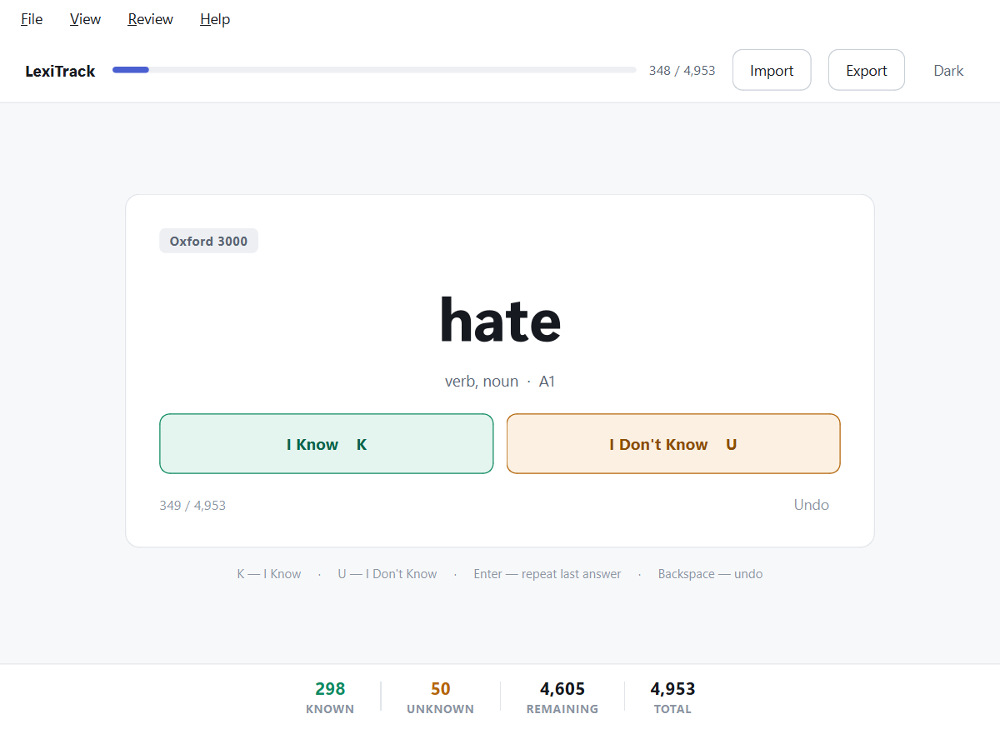
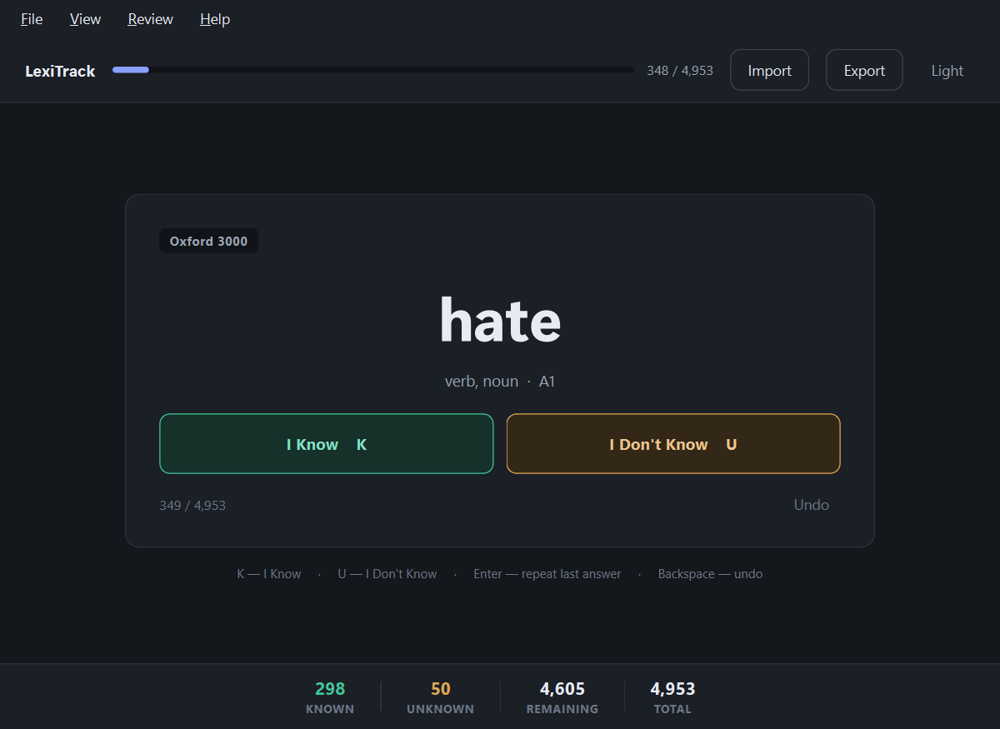
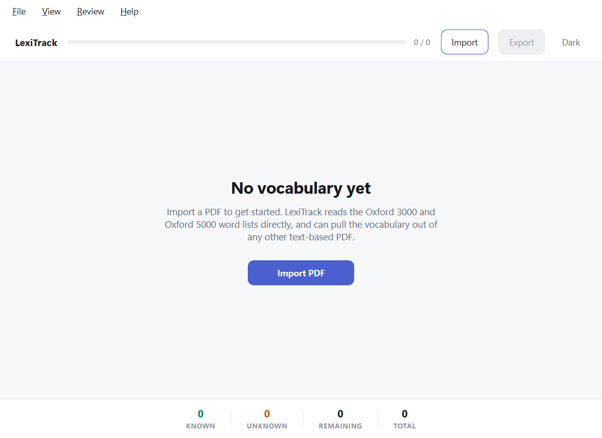
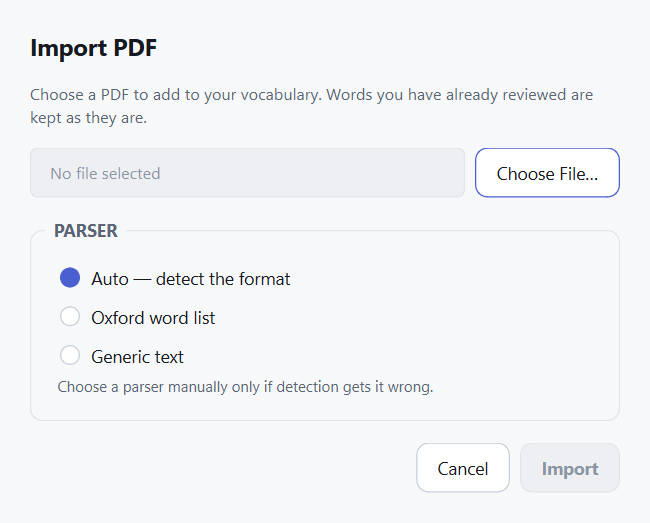
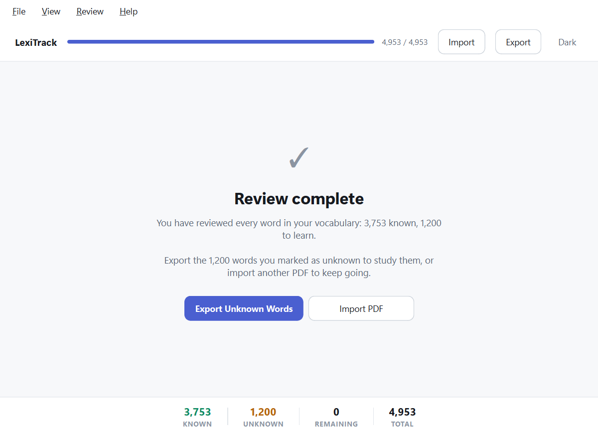
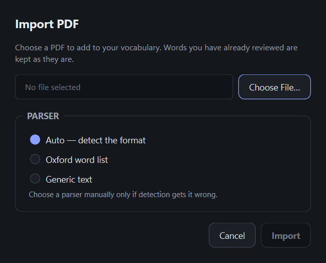
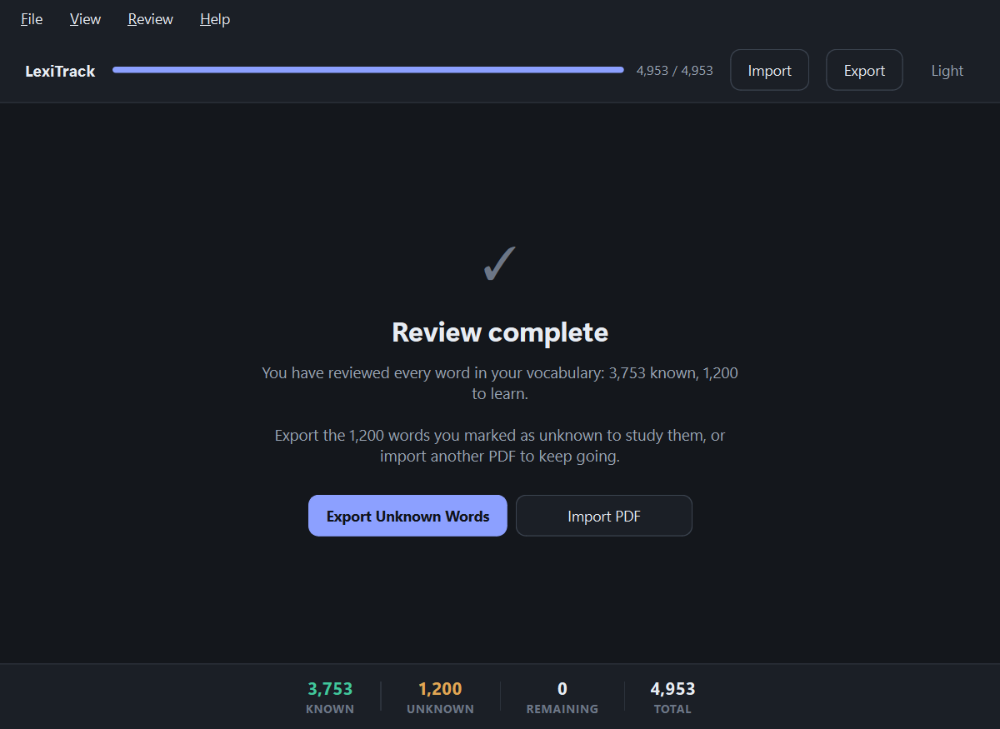

# LexiTrack

**PDF Vocabulary Learning & Review**

LexiTrack turns a PDF into a vocabulary review session. Import a word list or
any text-based document, and LexiTrack shows you the words one at a time. You
answer **I Know** or **I Don't Know**, and it remembers — so you can close the
app at word 1,200 and pick up at 1,201 tomorrow. When you are done, export
everything you did not know as a printable PDF or a CSV.

It runs entirely on your machine. There is no account, no server and no
network access; your vocabulary lives in a local SQLite file.



<p align="center">
  <em>The review screen, part-way through the Oxford 3000 and 5000.</em>
</p>

<details>
<summary><b>The same screen in dark mode</b></summary>

<br>



Light and dark are two separately designed palettes rather than one inverted
into the other, so neither glares and both keep the same contrast.

</details>

---

## Features

- **Import any text-based PDF.** The Oxford 3000 and Oxford 5000 "by CEFR
  level" lists are parsed properly, with each word's part of speech and level;
  anything else falls back to plain word extraction.
- **One word at a time.** A review screen built for long sessions, with the
  word large and the two answers always in the same place.
- **Keyboard-first.** `K` and `U` answer, `Enter` repeats your last answer,
  `Backspace` undoes. The mouse works just as well.
- **Your progress persists.** Review state lives in SQLite and is derived from
  the database, so closing the app mid-session loses nothing.
- **One word, asked once.** `ability` appears in both Oxford lists; you are
  asked about it once, and both sources are recorded.
- **Safe re-imports.** Importing the same document again adds nothing and
  changes no answers.
- **Export what you don't know.** A clean printable PDF, or a CSV for Excel
  and Anki.
- **Light and dark themes**, remembered between runs.

## Requirements

- **Python 3.11 or newer**
- **Windows 10/11** — developed and tested here. The code has no
  Windows-specific dependencies and should run on macOS and Linux, but that is
  untested.
- Roughly 250 MB of disk space, almost all of it PySide6.

## Installation

```bash
git clone <your-repository-url> LexiTrack
cd LexiTrack
```

Create a virtual environment and install the project. On Windows:

```bash
python -m venv .venv
.venv\Scripts\activate
pip install -e .
```

On macOS or Linux, use `source .venv/bin/activate` instead.

Dependencies are declared in `pyproject.toml`; there is no `requirements.txt`.
To work on LexiTrack, install the development extras as well:

```bash
pip install -e ".[dev]"
```

## Running

```bash
lexitrack
```

Or, without activating the environment:

```bash
python -m lexitrack
```

The database and export folder are created automatically on first launch. You
do not need to set anything up.

## Testing

```bash
pytest
```

The suite is 162 tests and runs in well under a minute. Tests that need the
real Oxford PDFs skip themselves when the files are not present — see
[Validation](#validation) below.

```bash
pytest -v                          # see each test name
pytest tests/test_oxford_parser.py # one file
ruff check lexitrack tests         # lint
```

## Usage

Here is the whole application, in the order you meet it.

### 1. First launch

On a clean install there is nothing to review yet, so LexiTrack explains the
next step instead of showing an empty screen.



### 2. Importing a PDF

**File → Import PDF…** (`Ctrl+O`), or the **Import** button.



Pick a file and leave the parser on **Auto** — LexiTrack recognises the Oxford
lists by their title and by their structure. If detection gets it wrong, pick a
parser by hand in the same dialog. Large documents are parsed on a background
thread with a progress bar, and cancelling leaves nothing behind.

### 3. Reviewing

The word fills the middle of the screen, with its part of speech and CEFR level
beneath it where the source provides them, the list it came from in the corner,
and your position in the queue at the bottom. The two answers are always in the
same place, so you can settle into a rhythm and stop aiming.


| Key | Action |
| --- | --- |
| `K` or `←` | I Know |
| `U` or `→` | I Don't Know |
| `Enter` | Repeat your last answer |
| `Backspace` | Undo the previous answer |
| `Ctrl+T` | Switch between light and dark |
| `Ctrl+O` | Import a PDF |

### 4. Resuming

Just reopen the app. LexiTrack asks the database for the first word you have
not reviewed, so there is no "continue" button and nothing to restore.

### 5. Finishing

When every word has been answered, LexiTrack tells you how the session went and
offers the obvious next step.



### 6. Exporting

**File → Export Unknown Words as PDF…** or **as CSV…**, or the **Export**
button. Only words you marked *unknown* are exported. The default location is
`data/exports/`.

The PDF is a printable table of word, part of speech, CEFR level and
definition. Where a source did not supply a column — a plain PDF has no CEFR
levels — the cell shows a dash rather than being left blank.

<p align="center">
  
</p>
<p align="center">
  <em>A page of an exported study sheet: your unknown words, ready to print.</em>
</p>

### 7. Switching theme

The button at the right of the app bar names the theme it will switch *to*
(`Ctrl+T`). Your choice is remembered between runs.

<details>
<summary><b>Dark mode: import dialog and completed screen</b></summary>

<br>





</details>

## Architecture

```text
             PDF
              │
              ▼
      ┌───────────────┐     OxfordParser
      │ ParserRegistry│ ──► GenericTextParser
      └───────┬───────┘     (future parsers)
              │
              ▼
          WordEntry          ← the standard model every parser produces
              │
              ▼
        Normalizer            ← Ability / ABILITY / ability → one identity
              │
              ▼
       Deduplicator           ← a runtime set, not storage
              │
              ▼
    VocabularyService         ← the only surface the UI talks to
              │
              ▼
       Repositories           ← the only code that issues SQL
              │
              ▼
          SQLite
              │
      ┌───────┴───────┐
      ▼               ▼
    Known          Unknown ──► PDF / CSV export
```

The layering is one-directional. The UI never issues SQL and never sees a
parser; the vocabulary engine never learns how a PDF was laid out. Two
separations matter most:

- **Parsers belong to documents, not to words.** Which parser runs is decided
  once per document. Supporting a new format means adding a parser, not
  changing anything downstream of `WordEntry`.
- **Source metadata and your review state are separate.** A word's level comes
  from the document; whether you know it does not. They live in different
  tables, which is why re-importing can never disturb your progress.

For the full picture, see [docs/ARCHITECTURE.md](docs/ARCHITECTURE.md).

## Supported parsers

### OxfordParser

Handles the official "Oxford 3000/5000 by CEFR level" PDFs published by Oxford
University Press. Extracts each word with its part of speech and CEFR level,
and copes with the quirks the real files contain: parenthesised sense
disambiguators that wrap across lines (`light (from the` / `sun/a lamp) n.`),
superscript homograph numbering (`can1`, `can2`), non-breaking-space multi-word
entries (`ice cream`), and comma-separated multi-form entries (`a, an`).

**Limitation:** neither published PDF contains definitions or example
sentences, so those fields stay empty for this source. That is a property of
the documents, not a gap in the parser.

### GenericTextParser

The fallback for everything else. Extracts every distinct word from any
text-based PDF, repairs words hyphenated across a line break, and keeps letters
only — numbers, punctuation and single letters are skipped.

**Limitation:** it produces words, nothing more. No part of speech, no level,
no definition, and no attempt to tell headwords from inflected forms. `run` and
`running` are two separate items, deliberately.

## Project structure

```text
lexitrack/
├── core/            paths, logging, the exception hierarchy
├── models/          WordEntry, Source, ReviewStatus, Progress
├── parsers/         Document, the parser protocol, Oxford, generic, registry
├── normalization/   word identity and runtime deduplication
├── repositories/    the only code that issues SQL
├── database/        connection handling and schema.sql
├── services/        import, vocabulary and export services
├── exporters/       PDF and CSV writers
├── ui/              PySide6 widgets, dialogs and the theme system
└── main.py          entry point

data/                database and exports (created at runtime, not committed)
pdfs/                put your source PDFs here (not committed)
docs/                architecture, decisions, status, log, TODO
tests/               the test suite
```

## Adding a new parser

1. Subclass `DocumentParser` in `lexitrack/parsers/`:

   ```python
   class CambridgeParser(DocumentParser):
       key = "cambridge"
       name = "Cambridge word list"
       description = "Cambridge vocabulary PDFs."
       priority = 90  # above generic (-100), below Oxford (100)

       def can_parse(self, document: Document) -> bool:
           return "Cambridge" in document.text(max_pages=1)

       def parse(self, document, progress=None) -> list[WordEntry]:
           ...
   ```

2. Register it in `default_parsers()` in `lexitrack/parsers/registry.py`.

That is the whole extension point. The registry picks the highest-priority
parser whose `can_parse` returns `True`, the new parser appears in the import
dialog automatically, and nothing downstream of `WordEntry` changes.

## Documentation

| Document | What it covers |
| --- | --- |
| [docs/PROJECT_STATUS.md](docs/PROJECT_STATUS.md) | Where the project stands and what to do next |
| [docs/ARCHITECTURE.md](docs/ARCHITECTURE.md) | The architecture as actually built |
| [docs/DECISIONS.md](docs/DECISIONS.md) | Why each significant choice was made |
| [docs/DEVELOPMENT_LOG.md](docs/DEVELOPMENT_LOG.md) | Chronological technical log |
| [docs/TODO.md](docs/TODO.md) | Now / Next / Later / Ideas |

## Validation

What has actually been verified, as opposed to merely written:

- **Both Oxford PDFs** were inspected before the parser was designed, and the
  parser was validated against them: every line of both documents is either an
  entry, a level heading or known page furniture, with **zero lines dropped**.
  A test enforces this.
- **A full import** of both lists produces 4,953 vocabulary items, with the 21
  words the two lists share asked about only once.
- **The UI** was launched and driven: both themes, the review loop, the
  keyboard shortcuts, undo, the welcome and completed screens, and re-import.
- **Exports** were generated from real data and their contents checked —
  unknown words present, known words absent.
- **162 tests pass** and `ruff check` is clean.

The Oxford PDFs are not committed (they are Oxford University Press material).
Put your own copies in `pdfs/` to run the tests that use them; they skip
otherwise, and the rest of the suite still passes.

## Known limitations

- **No OCR.** Scanned, image-only PDFs are detected and reported clearly, not
  silently imported as empty. Adding OCR is out of scope for now.
- **No lemmatization.** `run`, `running` and `ran` are three separate items.
  Merging them is a linguistic decision that loses meaning, so it is not done
  automatically.
- **No spaced repetition.** A word is reviewed once. There is no scheduling,
  no confidence score and no review history yet.
- **Exports cover unknown words only.** There is no "export everything" mode.
- **Deduplication merges senses.** Oxford lists `bank (money)` and
  `bank (river)` separately; LexiTrack treats them as one word so it does not
  ask twice. The senses are stored but not shown during review.
- **Non-Windows platforms are untested.** Nothing in the code is
  Windows-specific, but it has only been run there.
- **English word lists only.** Normalization handles Unicode correctly, but
  the parsers and UI copy assume English.

## License

MIT. The Oxford 3000 and Oxford 5000 word lists are © Oxford University Press
and are not distributed with this project.
