# Design directions for 0.2

Before the 0.2 interface was built, three directions were explored. Every
screenshot here is rendered from LexiTrack's real components and stylesheet,
filled from a real database (the Oxford PDFs plus the lists in `examples/`), so
they show what the application can actually draw.

Regenerate with `python tools/design_mockups.py`.

**Chosen: A**, without its separate Lists tab (Home already is the list hub).
The reasoning is in [DECISIONS.md §34](../DECISIONS.md). The finished
interface is shown in the main [README](../../README.md).

---

## A — Conservative evolution

The existing app bar, card and stats bar, extended with tabs, a "continue
learning" panel and list cards.

| Home | Flashcard |
| --- | --- |
| 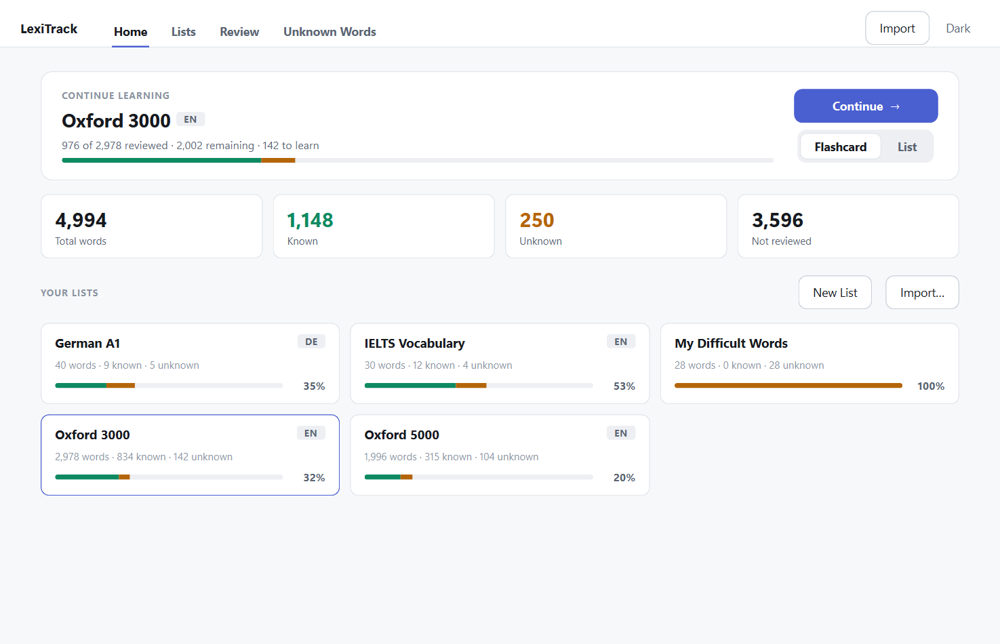 | 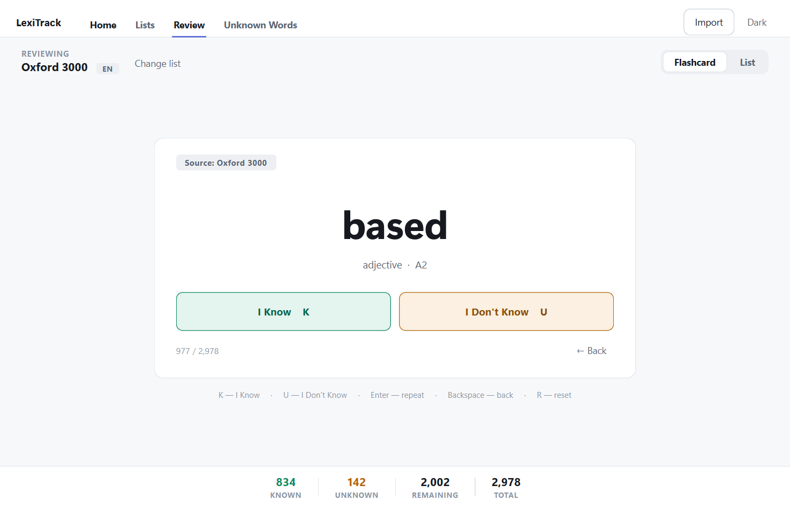 |
| **List** | **Unknown Words** |
| 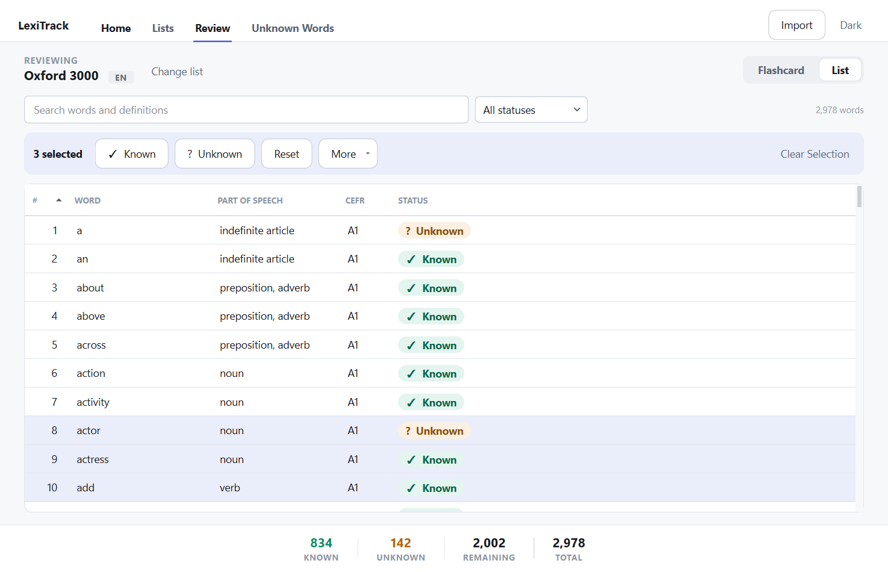 | 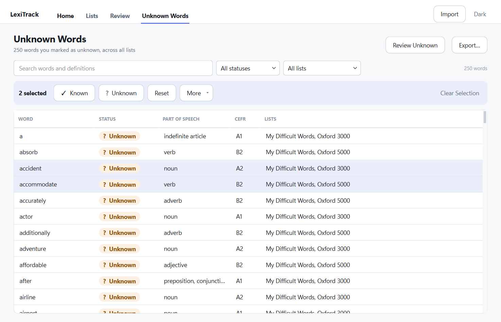 |

Dark: [home](design-a-home-dark.png) · [flashcard](design-a-flashcard-dark.png)

## B — Modern dashboard

A sidebar with lists always visible, statistics tiles, recent activity and
quick actions.

| Home | Flashcard |
| --- | --- |
| 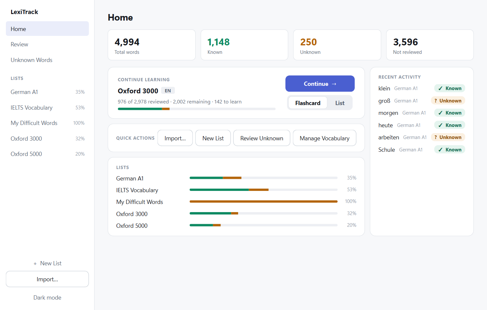 | 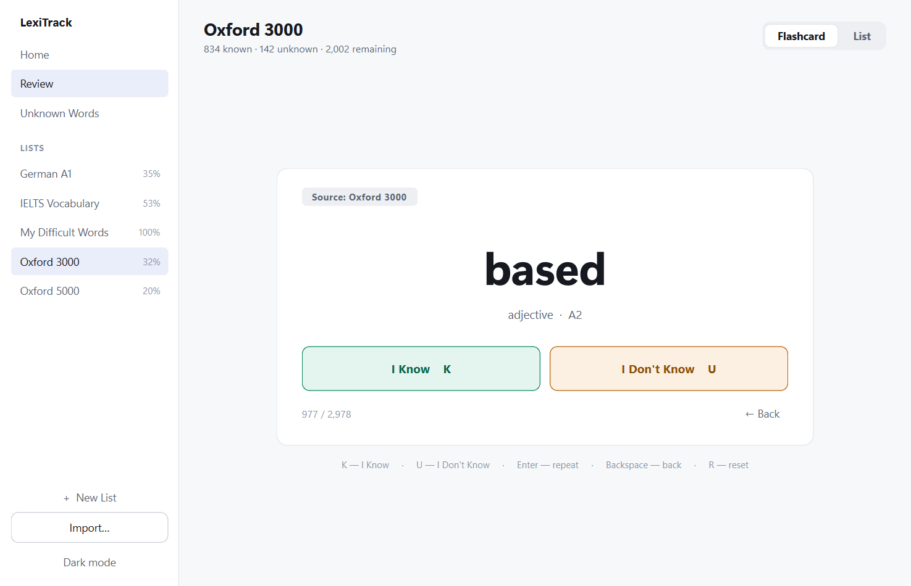 |
| **List** | **Unknown Words** |
| 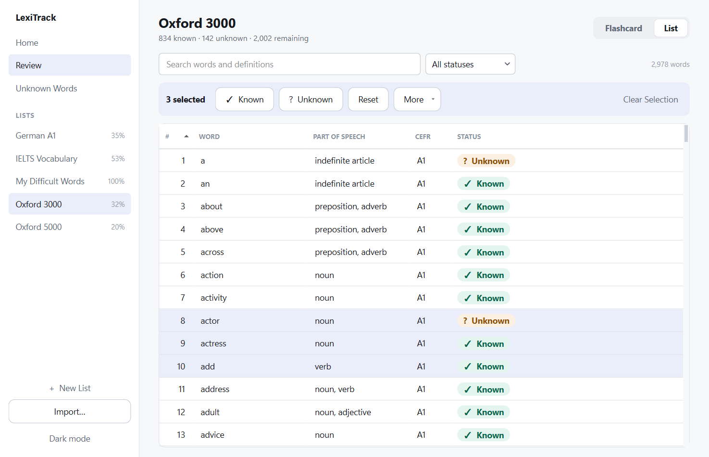 | 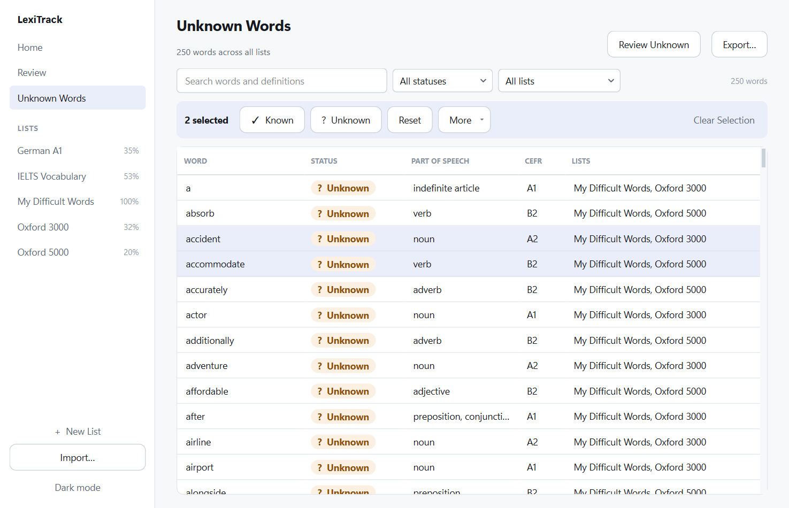 |

Dark: [home](design-b-home-dark.png) · [flashcard](design-b-flashcard-dark.png)

## C — Minimal learning workspace

A slim bar with a list selector and the mode switch; the learning area fills
the window, with lists in a drawer.

| Home | Flashcard |
| --- | --- |
| 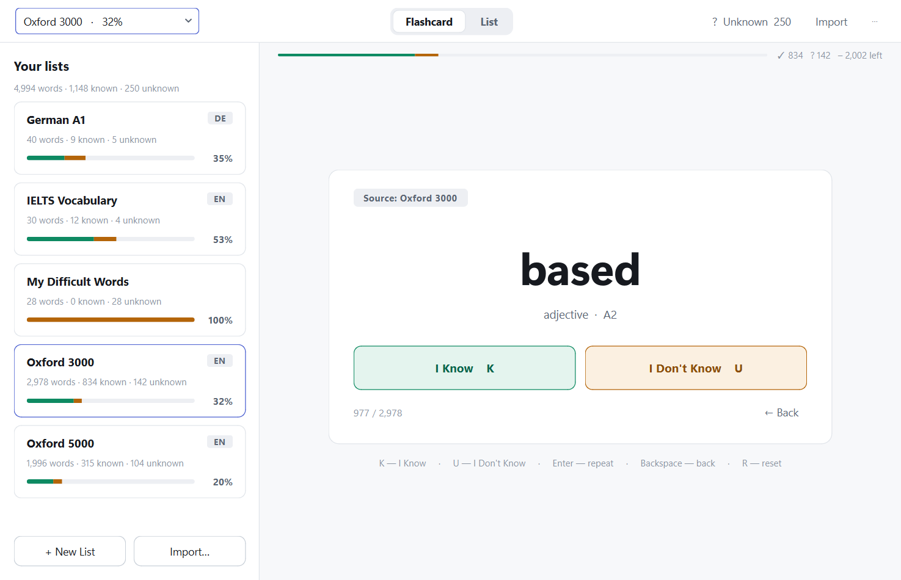 | 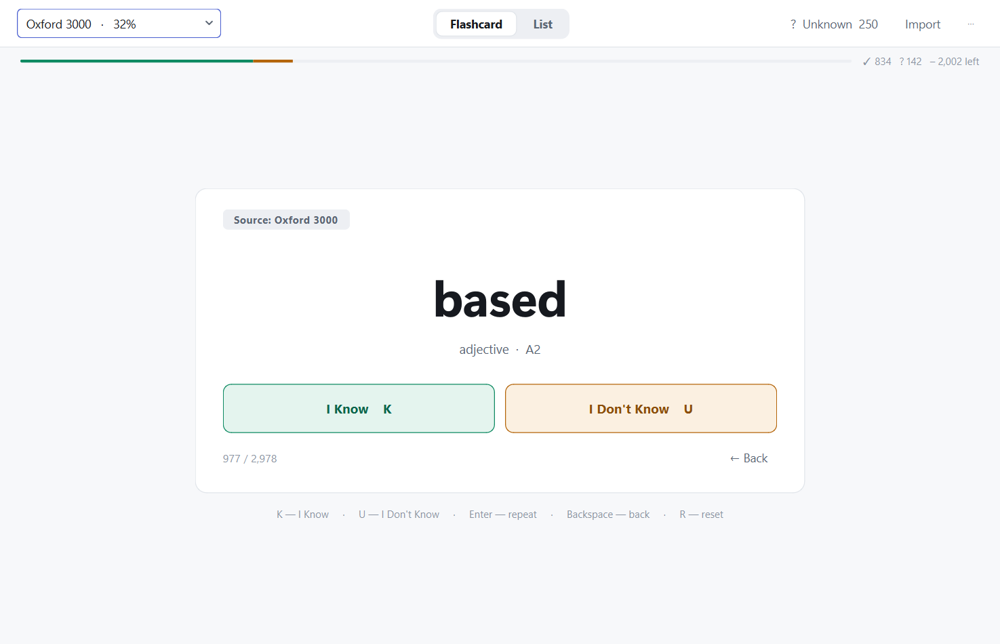 |
| **List** | **Unknown Words** |
| 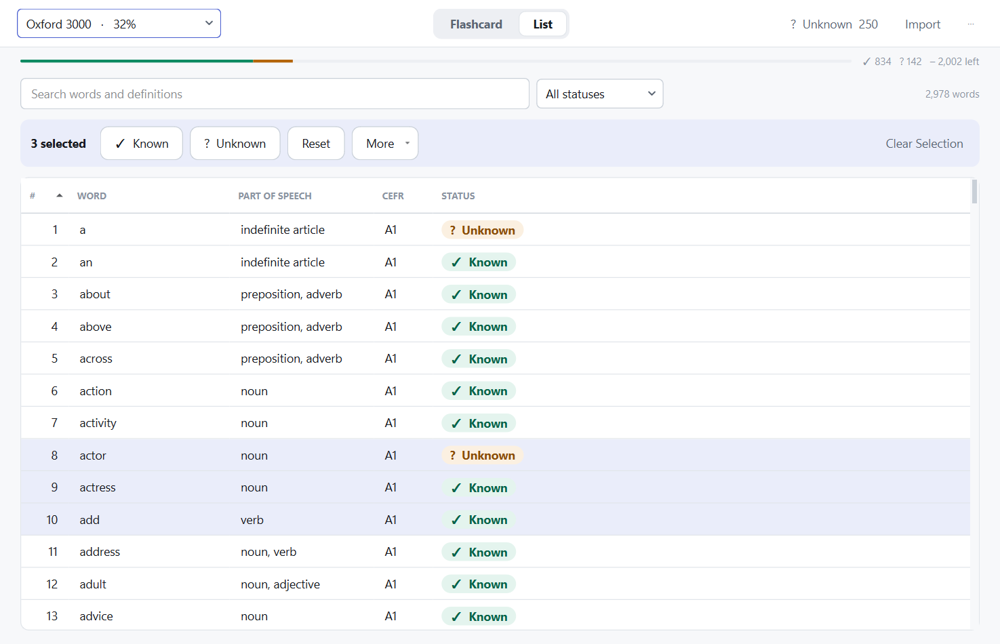 | 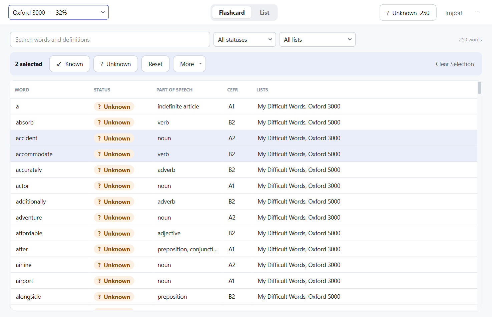 |

Dark: [home](design-c-home-dark.png) · [flashcard](design-c-flashcard-dark.png)
